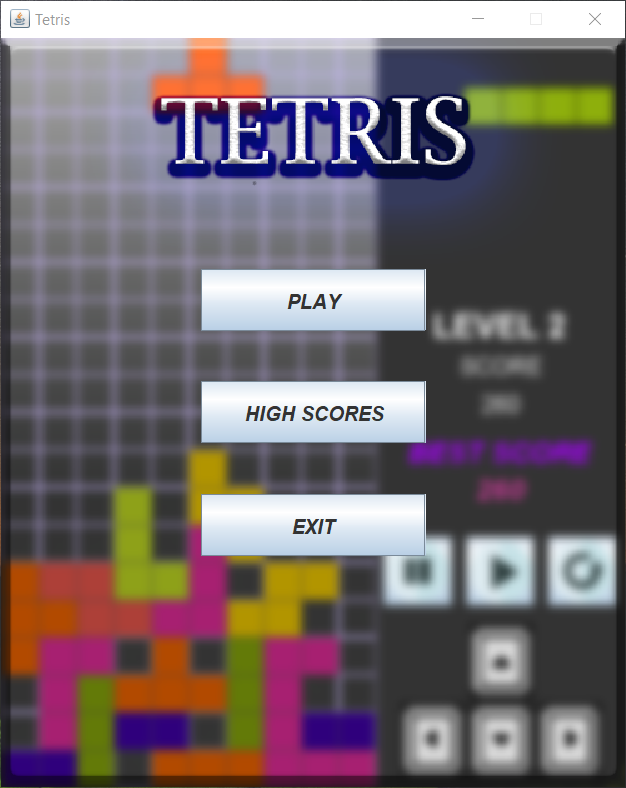
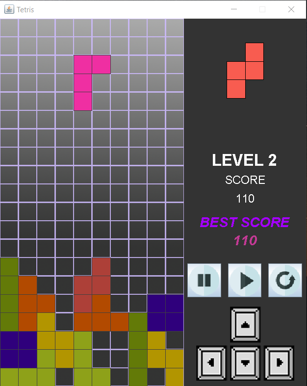
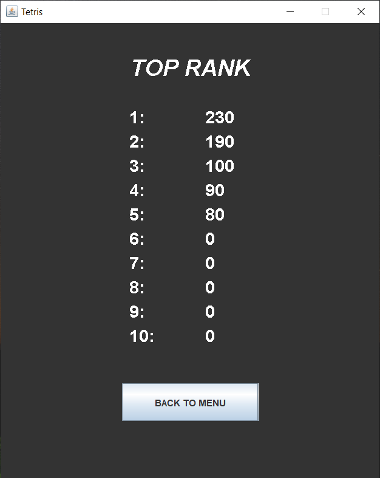
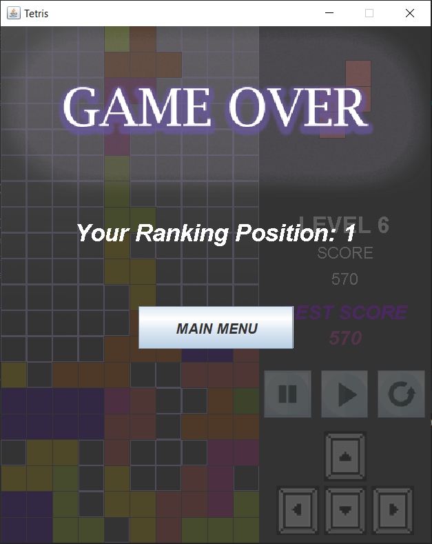

<h1>Tetris</h1>
<h3>Game implementation for University</h3>

Classic Tetris game with extras like Database score saving, ranking positions and in memory ranking.

Implementen in Java 
GUI made in Swing

<table width="100%">
    <tr>
        <th width="40%"> Game Fragment </th>
        <th width="60%"> Screenshot </th>
    </tr>
    <tr>
        <td> <b>Main Menu</b> </td>
        <td align="center"> 
    </tr><tr>
        <td> <b>Game</b> </td>
        <td align="center"> 
    </tr>
    <tr>
        <td> <b>Scoreboard</b> </td>
        <td align="center"> 
    </tr>
    <tr>
        <td> <b>Game Over</b> </td>
        <td align="center"> 
    </tr>
</table>